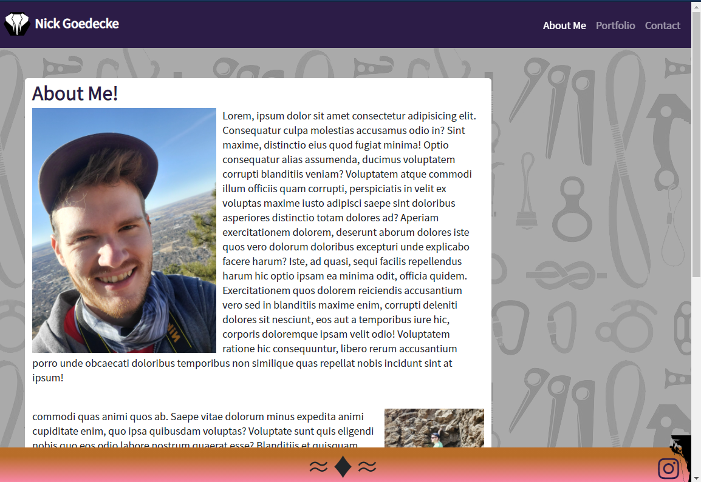
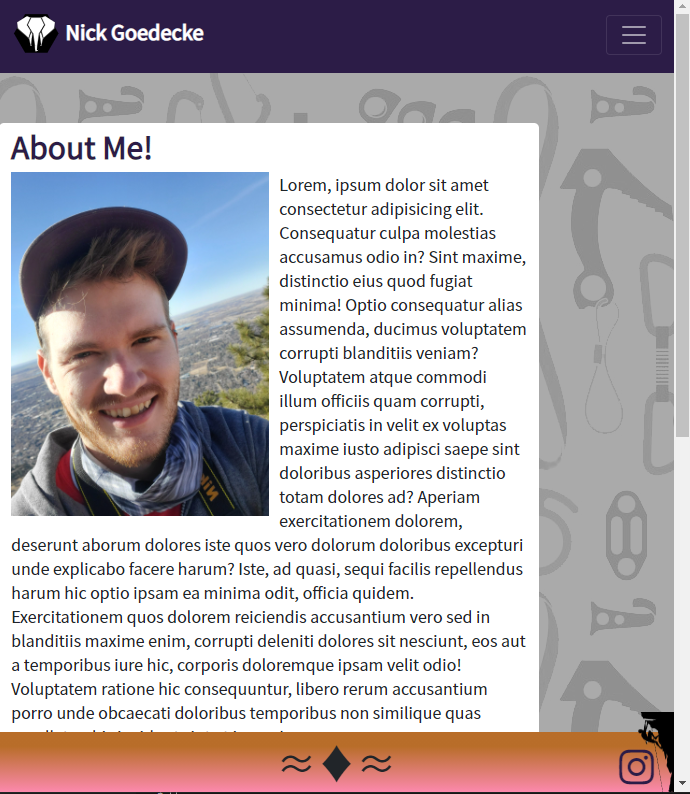

# AboutMe

# Purpose

Here is the url to the site:
<a href="https://perkyderm.github.io/AboutMe/">ME</a>

The purpose of this site is to display use of responsives when using different sized viewports.

I achevied this by applying the collapse feature to the <nav> and either used the "container-fluid" bootstrap feature or set up a media query in CSS that limits or changes a container size.

# Usage

In order to start, enter the url into a broswer.

To see the responsiveness in action, first, open devtools in your browser while on my AboutMe. Then Selcet the viewport to be responisve and reduce the window size to see the change!

Use links in the navbar to navigate to other pages, use the links in the footer to navigate to my Instagram or Mountainproject.

# Note

The contact form does not currently work. Pleae do not attepmt to send information at this time.
